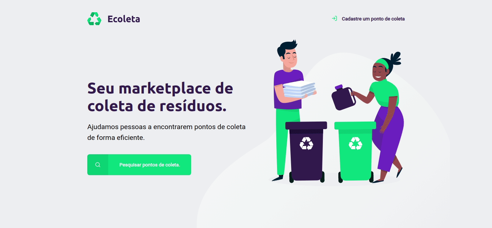

<h1 align="center">
    
</h1>

<p align="center">
  

  
	
  <a href="https://www.linkedin.com/in/luishclaudino/">
    
  </a>

  <a href="https://github.com/luishclaudino/ecoleta/commits/master">
    
  </a>

  
   <a href="https://github.com/luishclaudino/ecoleta/stargazers">
    
  </a>
</p>

<p align="center">
  <a href="#bulb-sobre">Sobre</a>&nbsp;&nbsp;&nbsp;|&nbsp;&nbsp;&nbsp;
  <a href="#movie_camera-preview-da-aplicação">Preview da Aplicação</a>&nbsp;&nbsp;&nbsp;|&nbsp;&nbsp;&nbsp;
  <a href="#rocket-tecnologias">Tecnologias</a>&nbsp;&nbsp;&nbsp;|&nbsp;&nbsp;&nbsp;
  <a href="#information_source-como-executar-a-aplicação">Como executar a Aplicação</a>&nbsp;&nbsp;&nbsp;|&nbsp;&nbsp;&nbsp;
  <a href="#thinking-como-contribuir">Como contribuir</a>&nbsp;&nbsp;&nbsp;|&nbsp;&nbsp;&nbsp;
  <a href="#memo-license">License</a>&nbsp;&nbsp;&nbsp;|&nbsp;&nbsp;&nbsp;
  <a href="#thumbsup-agradecimentos">Agradecimentos</a>
</p>

## :bulb: Sobre

<p>Como homenagem à Semana do Meio Ambiente, este projeto foi desenvolvido para ajudar na conscientização das pessoas sobre o tema de geração e descarte de lixo.</p>
<p>A ideia dessa aplicação é permitir que clientes pesquisem pontos de coleta numa cidade e que empresas de coleta de resíduos cadastrem seus locais e categorizem suas especialidades, tais como:</p>
<ul>
<li>Lâmpadas</li>
<li>Pilhas e Baterias</li>
<li>Papéis e Papelão</li>
<li>Resíduos Eletrônicos</li>
<li>Resíduos Orgânicos</li>
<li>Óleo de Cozinha</li>
</ul>

## :movie_camera: Preview da Aplicação



## :rocket: Tecnologias

Este projeto foi feito utilizando as seguintes tecnologias:

- HTML
- CSS
- Javascript
- Node.js
- Nunjucks
- SQLite

## :information_source: Como executar a Aplicação

Para clonar e inicializar esta aplicação, você precisará do [Git](https://git-scm.com) e do [Node.js](https://nodejs.org/en/download/) instalados no seu computador.

Após isso, abra o terminal e digite os seguintes comandos:

```bash
# Clone esse repositório
$ git clone https://github.com/luishclaudino/ecoleta

# Entre na pasta principal
$ cd ecoleta

# Instalando as dependências do projeto
$ npm install

# Criar o banco de dados local
$ node src/database/db.js 

# Inicializar o server
$ npm start

# O server estará rodando na porta 3000
```

Após isso só precisa acessar seguinte o endereço no seu navegador: `http://localhost:3000/`

## :thinking: Como contribuir

- Faça um fork;
- Crie uma branck com sua feature: `git checkout -b my-feature`;
- Faça o commit das mudanças: `git commit -m 'feat: My new feature'`;
- Faça um push para a branch principal: `git push origin my-feature`.

Depois de realizar o merge da sua contribuição, você pode excluir a sua branch.

## :memo: License

Este projeto está sob a licença MIT. Veja o arquivo [LICENSE](https://github.com/luishclaudino/ecoleta/blob/master/LICENSE) para mais detalhes.

## :thumbsup: Agradecimentos

Quero agradecer a [Rocketseat](https://github.com/Rocketseat) por promover a Next Level Week 1.0 e disponibilizar conhecimento gratuitamente.

---

Made with ♥ by Luis Henrique Claudino Silva :wave: [Get in touch!](https://www.linkedin.com/in/luishclaudino/)
